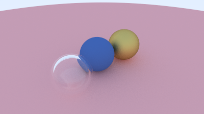

# Raytracer

My attempt at making CPU raytracer in Rust.

Features:

- rendering spheres, cubes, triangles and meshes (gltf only)
- multithreading

Resources:

- [Raytracing in One weekend](https://raytracing.github.io/books/RayTracingInOneWeekend.html)

Demo

